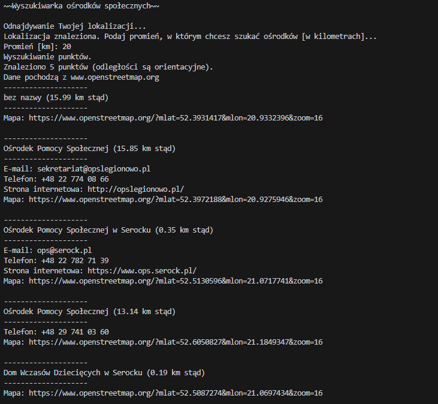

# Social amenity finder

## Example



## Running the script

`uv` package manager is required. [Install instructions.](https://docs.astral.sh/uv/getting-started/installation/)

```bash
uv sync
uv run main.py
```

## License

GNU AGPL v3